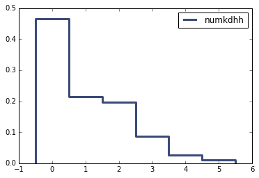
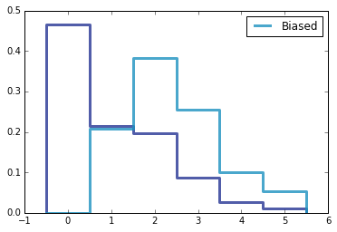

[Think Stats Chapter 3 Exercise 1](http://greenteapress.com/thinkstats2/html/thinkstats2004.html#toc31) (actual vs. biased)

Actual PMF

Biased and Actual PMF

Actual Mean: 1.0242051550438309
Biased Mean: 2.4036791006642821
