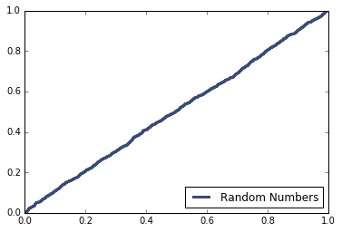
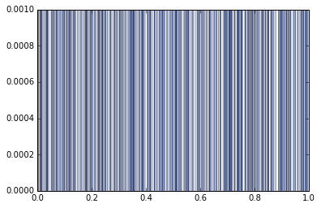

[Think Stats Chapter 4 Exercise 2](http://greenteapress.com/thinkstats2/html/thinkstats2005.html#toc41) (a random distribution)

CDF of random numbers

PMF of random numbers

The Distribution is uniform.  This is especially evident in the CDF graph which shows approximately a straight line.
